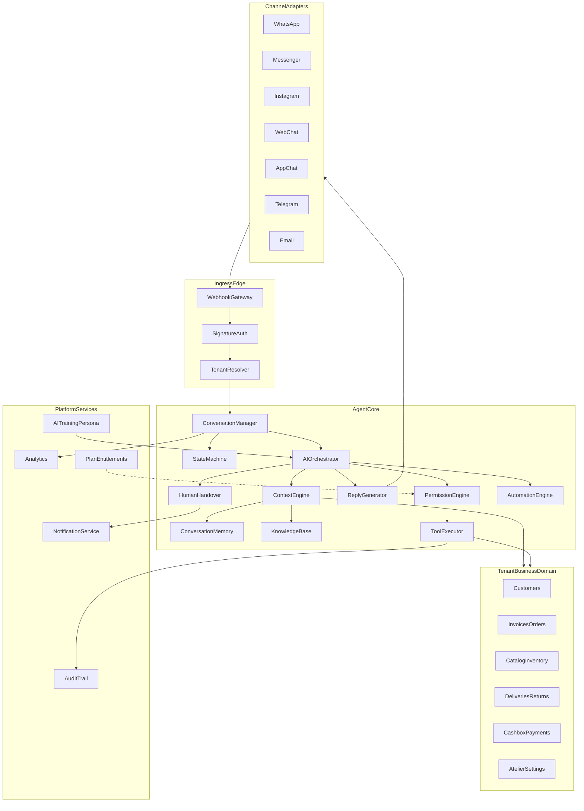

# DressnMore AI Agent Platform — Enterprise Architecture

**Document type:** Solution Architecture (Architecture-only)  
**Product:** DressnMore Multi-Tenant SaaS  
**Platform:** AI Agent Platform (Digital Employee OS)  
**Version:** 1.0 (Architecture Freeze)  
**Non-goals:** Chatbot UX, WhatsApp bot, generic AI assistant, implementation artifacts (code / DB / APIs / UI)

---

## 0. Executive Positioning

The platform is not a chat UI. It is an **operating system for a digital employee** that works inside the atelier with the same operational logic as a human staff member:

| Concept | Architectural meaning |
|---------|------------------------|
| Employee | Operational identity with permissions, mode, persona, shift semantics, and accountability |
| Channel | I/O pipe only (WhatsApp today; Messenger / Instagram / Web / App / Telegram / Email later) |
| Conversation | Operational work unit — not “a chat product” |
| Tool | Business action via existing Tenant domain services |
| Handover | Ownership transfer between AI and human staff |

**Hard separation principle:**

- `Channel Adapter` does not know business logic.
- `Business Tools` do not know the channel.
- `AI Orchestrator` does not store Tenant data directly — it requests data via Context + Tools within permission bounds.

**Fit with current DressnMore:**

- Custom tenancy: `X-Tenant` / query / subdomain → `tenant_{slug}`
- Central: subscriptions, plans, platform CRM, platform roles
- Tenant DB: customers, dresses/inventory, invoices/rental/tailoring, delivery, cashbox, accounting, HR, settings
- No WhatsApp Business API today — the channel is added as an Adapter without touching Agent core

---

## 1. Architectural Style

- **Independent Bounded Context:** `AI Agent Platform` beside Tenant Ops and Platform Admin
- **Hexagonal / Ports & Adapters** for channels
- **Orchestration Pipeline** per inbound message
- **Policy-as-Code** for permissions and operating modes
- **Event-driven** notifications, human handover, analytics
- **Strict Tenant Isolation** on every hop (Resolver + Context Bound + Tool Guard)

Detailed module definitions: [module-catalog.md](./module-catalog.md).

---

## 2. High-Level Module Interaction (Logical)

1. Channel normalizes the message.
2. Ingress validates and forwards.
3. Tenant Resolver maps channel account → Tenant.
4. Conversation Manager opens/continues the conversation and updates the State Machine.
5. Contact Resolver binds the customer.
6. Orchestrator requests a Context Bundle.
7. Permission Engine filters capabilities for the current operating mode.
8. If needed: Tool Executor runs against Tenant domain.
9. Decision: AI reply, Human Handover, or approval request.
10. Reply Generator emits a channel-compatible message.
11. Adapter delivers to the client.
12. Analytics + Audit record everything.

---

## 3. Design Principles (Non-negotiables)

1. **Channel-agnostic core** — adding a channel = new Adapter only  
2. **Tenant isolation by binding, not by inference**  
3. **Least privilege tools** — Deny by default  
4. **Human is always a first-class coworker**  
5. **Every action auditable like an employee**  
6. **Mode ≠ Permission** — both apply together  
7. **No business logic inside webhooks**  
8. **Context is curated, not dumped**

See ADRs under [adr/](./adr/).

---

## 4. Spec Index

| Topic | Spec |
|-------|------|
| Message journey | [message-journey.md](./message-journey.md) |
| Tenant Resolver | [tenant-resolver.md](./tenant-resolver.md) |
| Context Engine | [context-engine.md](./context-engine.md) |
| Human Handover | [human-handover.md](./human-handover.md) |
| Permission Engine | [permission-engine.md](./permission-engine.md) |
| Operating modes | [operating-modes.md](./operating-modes.md) |
| WhatsApp wizard | [onboarding-wizard.md](./onboarding-wizard.md) |
| State machine | [conversation-state-machine.md](./conversation-state-machine.md) |
| Roadmap | [roadmap.md](./roadmap.md) |
| Phase 1 plan | [phase-1-delivery-plan.md](./phase-1-delivery-plan.md) |
| **Domain Model (DDD)** | [domain-model/README.md](./domain-model/README.md) |
| **Use Cases (Behavior)** | [use-cases/README.md](./use-cases/README.md) |
| **Business Tool Contracts** | [business-tools/README.md](./business-tools/README.md) |

---

## 5. Deliverable Boundary for This Freeze

This pack freezes architectural decisions only.

**Explicitly out of scope now:** table designs, API contracts, UI, LLM vendor choice, or application code.

**Next after this freeze:** execute Phase 1 per [phase-1-delivery-plan.md](./phase-1-delivery-plan.md), or deepen ADRs further if product requires it.
