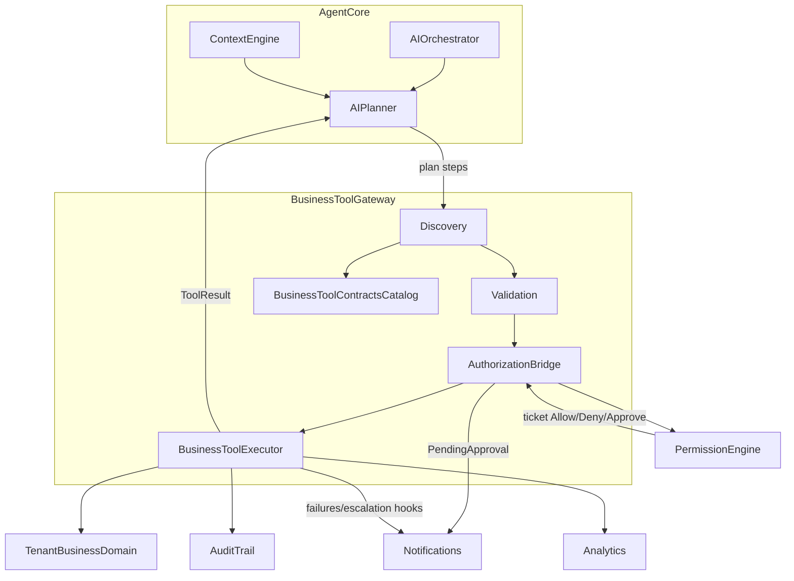

# Business Tool Architecture (Conceptual)

Official relationship between planning, contracts, permissions, execution, and observability.

## Boundary statements

1. **Planner** selects Tools; never calls Domain directly.  
2. **Contracts Catalog** is the schema of truth for Tool names/versions.  
3. **Permission Engine** is the only authority for tickets.  
4. **Executor** is the only component that crosses into Tenant Business Domain.  
5. **Audit/Analytics** observe every terminal Tool attempt.  
6. **Notifications** serve Approval and failure collaboration — not business mutation.
