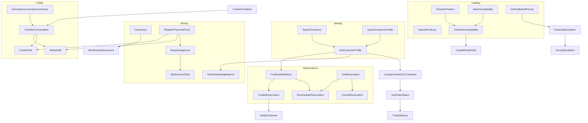

# Tool Dependency Graph

Logical dependencies for planning (not DB FKs). Solid edges = typically required before; dashed = optional enrichment.

## Example plans (from Use Cases)

### “المتبقي عليّ وأحجز بروفة”
1. `SearchCustomer` / `GetCustomerProfile`  
2. `GetOutstandingBalance`  
3. `FindAvailableSlots`  
4. `CreateReservation` (Approval if required)  
5. Reply composition (not a Tool)

### “استئجار فستان لتاريخ معيّن”
1. Qualify → `SearchAvailability`  
2. `CheckItemAvailability`  
3. Optional `CreateRentalHold`  
4. `FindAvailableSlots` → `CreateReservation`  
5. `NotifyCustomer` / Reply  

### “إيصال تحويل”
1. `GetCustomerProfile`  
2. Optional `GetInvoice` / `GetOutstandingBalance`  
3. `RegisterPaymentProof`  
4. `CreateTask` + `NotifyStaff`  
5. **Not** `MarkInvoicePaid` without Approval/Human  
