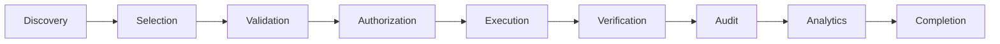

# Tool Lifecycle

Every Tool call passes through these stages inside the Business Tool Gateway.

| Stage | Responsibility |
|-------|----------------|
| **Discovery** | Planner sees only Tools enabled for Tenant + Agent Policy + Mode |
| **Selection** | Choose Tool(s) for intents; build plan order from dependencies |
| **Validation** | Contract input rules; Isolation Key; conversation state allows tools |
| **Authorization** | Permission Engine → Allow / Deny / RequireApproval (+ ticket) |
| **Execution** | Executor calls Tenant Ops port; timeouts/retries per policy |
| **Verification** | Outcome matches contract Possible Outcomes; side effects acknowledged |
| **Audit** | Append ToolAuthorized/Executed/Failed/Denied (+ Approval events) |
| **Analytics** | Emit tool metrics events |
| **Completion** | Return Tool Result to Orchestrator; update Memory if needed |

## Stage failure handling

| Failed stage | Result to Planner |
|--------------|-------------------|
| Discovery missing tool | Treat as Deny; Clarify/Escalate |
| Validation | Failed result; no Ops call |
| Authorization Deny | ToolDenied; Escalate if needed for UX |
| Authorization Approval | PendingApproval; stop plan writes |
| Execution | ToolFailed; retry/fallback policy |
| Verification mismatch | ToolFailed + safe Escalate |
