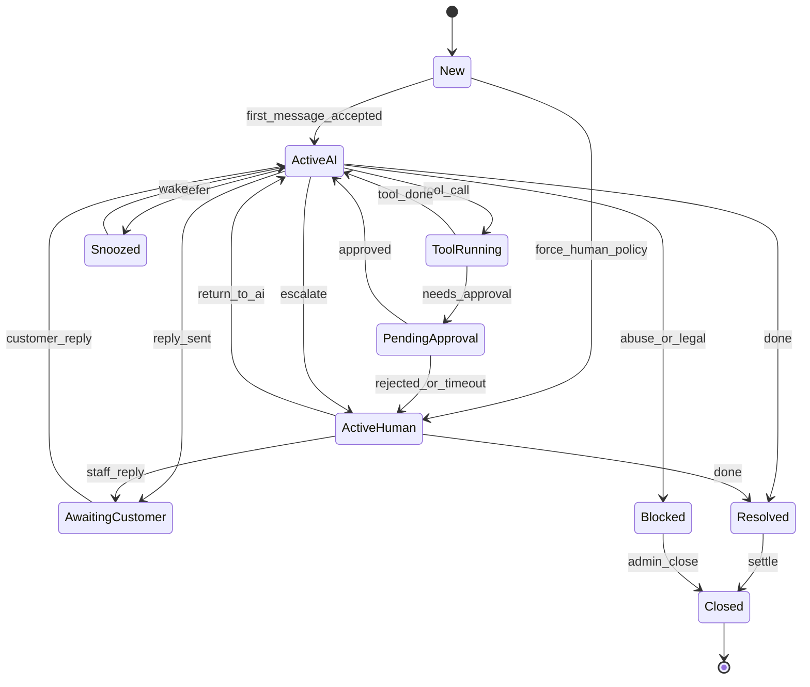

# Conversation State Machine

Formal lifecycle from first accepted message to archival close.

## State meanings

| State | Meaning |
|-------|---------|
| `New` | First message accepted after binding |
| `ActiveAI` | Digital employee owns the conversation |
| `AwaitingCustomer` | Reply sent; waiting on customer |
| `ToolRunning` | Business tool in flight |
| `PendingApproval` | Waiting on staff for a sensitive action |
| `ActiveHuman` | Human owns replies |
| `Snoozed` | Waiting on external event (e.g. delivery tomorrow) |
| `Resolved` | Operationally finished |
| `Closed` | Archived |
| `Blocked` | Safety / legal stop |

## Transition guards (conceptual)

- Illegal transitions are rejected and audited.
- `escalate` always records reason code.
- `return_to_ai` requires Human ownership.
- `Closed` is terminal except controlled reopen policies (future), not Phase 1.
