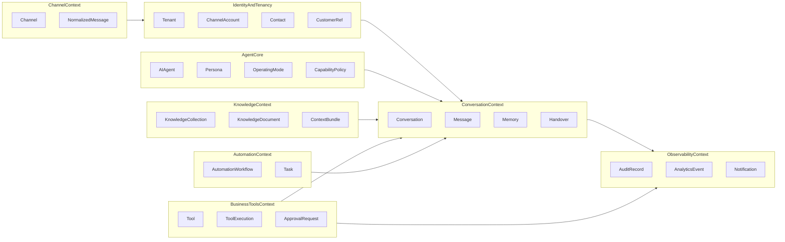
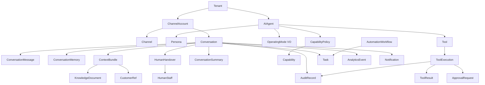

# AI Agent Domain Model — Master

**Document type:** Conceptual Domain Model (DDD)  
**Platform:** DressnMore AI Agent Platform (Digital Employee OS)  
**Version:** 1.0  

This model describes **what exists in the business language of the platform**, not how it is stored or coded.

## Core metaphor

The platform manages a **Digital Employee** (`AI Agent`) that:

- speaks through **Channels**,
- works inside **Conversations**,
- reasons over a curated **Context Bundle**,
- acts via **Tools** under **Capabilities / Permissions**,
- collaborates with **Human Staff** through **Handover**,
- learns persona/knowledge through **Training** artifacts,
- remains accountable via **Audit** and measurable via **Analytics**.

## Bounded Context map (summary)

## Aggregate roots (summary)

| Aggregate Root | Boundary protects |
|----------------|-------------------|
| `AIAgent` | Persona, mode, capability policy, channel bindings for that agent |
| `Conversation` | Messages, ownership, state, memory slices, active handover |
| `KnowledgeCollection` | Documents and publish state within a collection |
| `AutomationWorkflow` | Steps, trigger binding, workflow run state |
| `ToolExecution` | Single execution attempt + result + permission ticket reference |
| `ApprovalRequest` | Requested action + decision lifecycle |
| `ChannelAccount` | Binding to Tenant + provider identifiers |

Full detail: [aggregates.md](./aggregates.md), [entities.md](./entities.md).

## High-level conceptual diagram

## Related architecture

This domain model implements the language of the Architecture Freeze. Module names in architecture map to these contexts — see [../module-catalog.md](../module-catalog.md).
