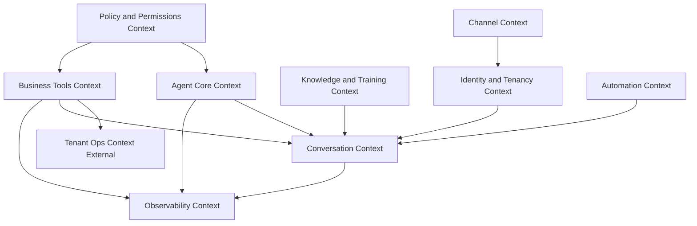

# Bounded Contexts

The AI Agent Platform is one product with **multiple Bounded Contexts**. Each context has its own vocabulary focus and published language at the boundaries.

---

## 1. Channel Context

**Responsibility:** Normalize inbound/outbound communication; know provider quirks; never know atelier business rules.

**Core concepts:** Channel, Channel Account (binding view), Normalized Message envelope, delivery status.

**Does not own:** Conversations, Tools, Customer master data.

---

## 2. Identity & Tenancy Context

**Responsibility:** Tenant isolation, channel→tenant binding truth, Contact identity, Customer Reference linking, Human Staff references.

**Core concepts:** Tenant, Channel Account (binding aggregate), Contact, Customer Reference, Human Staff ref.

**Published language:** `TenantExecutionContext`, `isolation_key`, `CustomerRef`.

---

## 3. Agent Core Context

**Responsibility:** Digital employee definition — who the employee is and how it should behave.

**Core concepts:** AI Agent, Persona, Prompt Template, Operating Mode (as applied config), Agent Health.

**Does not own:** Live Conversations (references Agent id only).

---

## 4. Policy & Permissions Context

**Responsibility:** Capability catalog and per-agent Capability Policy; answer allow/deny/require_approval.

**Core concepts:** Capability, Capability Policy, Approval thresholds (as policy), Permission decision.

**Boundary rule:** Mode overlays this context; it never expands grants.

---

## 5. Conversation Context

**Responsibility:** Operational work unit lifecycle — messages, ownership, memory, handover, summaries.

**Core concepts:** Conversation, Message, Memory, Summary, Human Handover, Context Bundle consumption pointer.

**Heart of runtime collaboration** between AI and humans.

---

## 6. Knowledge & Training Context

**Responsibility:** Atelier brain content and controlled learning artifacts.

**Core concepts:** Knowledge Collection/Document/Source, Learning Record, Training Dataset, Persona training inputs.

**Does not execute tools** and does not own channel traffic.

---

## 7. Business Tools Context

**Responsibility:** Catalog and execute Tools against Tenant Ops through an anti-corruption layer.

**Core concepts:** Tool, Tool Execution, Tool Result, Business Object Reference, Approval Request (when tied to execution).

**Depends on:** Policy Context for tickets; Tenant Ops for real business entities.

---

## 8. Automation Context

**Responsibility:** Time/event-driven workflows that create Tasks, notifications, or conversation touches without a live inbound message.

**Core concepts:** Automation Workflow, Workflow Step, Task.

---

## 9. Observability Context

**Responsibility:** Audit, analytics, and staff notifications as consequences of other contexts.

**Core concepts:** Audit Record, Analytics Event, Notification.

**Read/append oriented** — must not redefine Conversation ownership rules.

---

## 10. Tenant Ops Context (External)

**Responsibility:** Source of truth for Customers, Invoices, Orders, Products/Dresses, Deliveries, Cashbox, etc.

**Relationship:** Consumed only via Business Tools / read ports. Agent Platform never becomes the system of record for these entities.

---

## Context integration style

| From → To | Integration |
|-----------|-------------|
| Channel → Identity | Binding lookup |
| Identity → Conversation | Tenant-scoped conversation start |
| Agent Core → Conversation | Agent id + persona snapshot |
| Policy → Tools / Conversation | Permission tickets / mode overlay |
| Knowledge → Conversation | Context contributions |
| Tools → Tenant Ops | Anti-corruption tool calls |
| All runtime → Observability | Domain events → audit/analytics/notifications |
