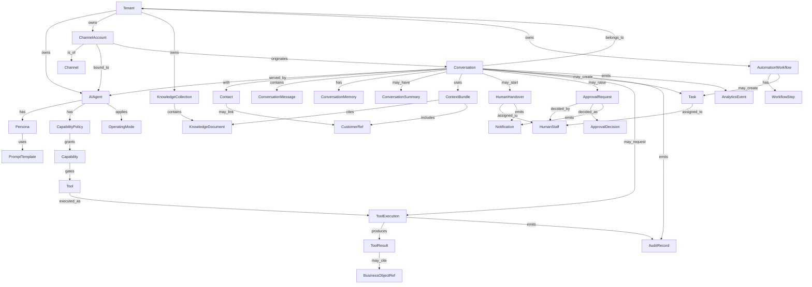

# Conceptual Relationships

Relationships are logical, not foreign-key designs.

## Relationship catalog (selected)

| Relationship | Cardinality | Rule |
|--------------|-------------|------|
| Tenant owns AI Agent | 1:N | Agent cannot move tenants |
| Tenant owns Channel Account | 1:N | Binding immutable to tenant after activate |
| Channel Account bound to AI Agent | N:1 (optional) | Active account should reference an Active agent |
| Conversation served by AI Agent | N:1 | Snapshot persona/policy may freeze per decision |
| Conversation contains Messages | 1:N | Message cannot move conversations |
| Conversation has Memory | 1:1 | Memory dies with conversation purge |
| Conversation uses Context Bundle | 1:N over time | Each decision cycle may assemble a new bundle |
| Capability Policy grants Capabilities | 1:N | Deny by default if missing |
| Capability gates Tool | N:N catalog | Execution still needs ticket |
| Tool Execution produces Tool Result | 1:0..1 | Present when terminal success/fail |
| Conversation may start Handover | 1:N over life | At most one *active* handover |
| Approval Request has Decision | 1:0..1 | Terminal once |
| Knowledge Collection contains Documents | 1:N | Publish rules apply |
| Automation Workflow has Steps | 1:N | Ordered |
| Workflow/Conversation create Task | N:N | Task links back by id |

## Anti-corruption relationships

| Agent Platform concept | External concept |
|------------------------|------------------|
| Customer Reference | Tenant Ops Customer |
| Business Object Reference | Invoice / Order / Dress / Delivery / … |
| Human Staff | Tenant User |
| Notification delivery | Existing Tenant notification channels |

These are **references**, never dual masters.
