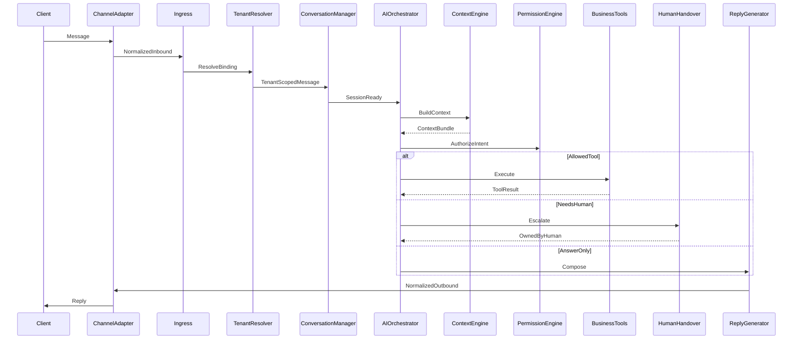

# Message Journey — Inbound to Reply

Architecture-level journey. No API or schema design.

## Step-by-step

1. **Client** — Sends via WhatsApp or any future channel.
2. **Channel Adapter** — Verifies provider signature, maps to the normalized model, retains raw payload for forensics.
3. **Webhook / Ingress** — Applies idempotency (dedupe), queues work, rejects unsigned or replayed traffic.
4. **Tenant Resolver** — Looks up `channel_account → tenant_id`. On failure: dead-letter + platform alert, **never** guess a tenant.
5. **Isolation Guard** — Attaches mandatory Tenant scope for every subsequent read/write.
6. **Conversation Manager** — Finds thread by `(tenant, channel, external_thread/contact)` or creates one; refuses cross-tenant merge.
7. **State Machine** — e.g. `New → ActiveAI`. If already `OwnedByHuman` / `ActiveHuman`, route to staff (side assist only if policy allows).
8. **AI Orchestrator** — Classifies intent and risk.
9. **Context Engine** — Builds the minimum sufficient bundle (see context-engine.md).
10. **Business Tools** — Execute only with a Permission Ticket.
11. **AI Decision** — Reply, clarify, escalate, or silent ack.
12. **Human Handover** — If required, transfer ownership and notify staff.
13. **Reply Generator** — Compose + safety filter.
14. **Channel Adapter** — Send + update delivery status.
15. **Client** — Receives the reply.

## Failure classes (conceptual)

| Failure | System behavior |
|---------|-----------------|
| Unknown channel binding | Reject; alert platform; no tenant DB touch |
| Idempotent duplicate | Ack provider; no second orchestration |
| Tool denied | Prefer clarify or escalate; never silent mutate |
| Channel send failure | Retry policy + staff notification; keep conversation open |
| Orchestrator timeout | Safe fallback message or escalate per mode |
