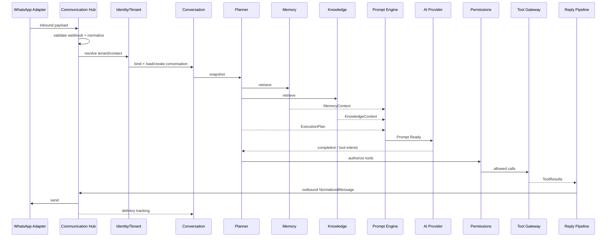
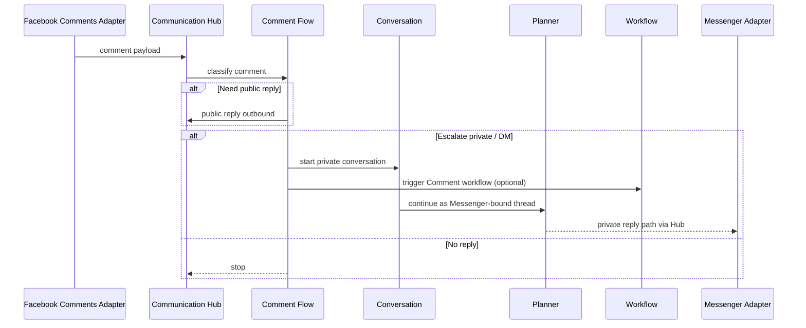
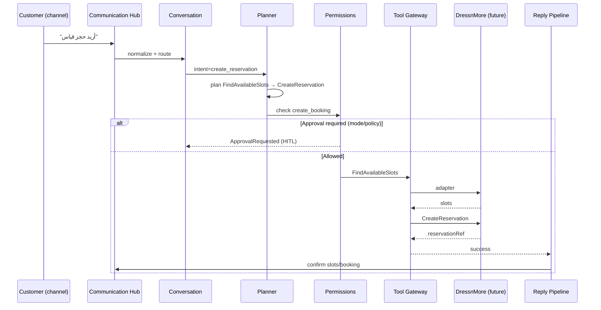
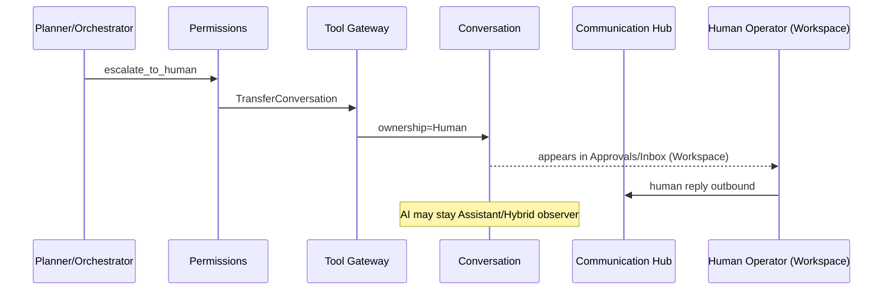
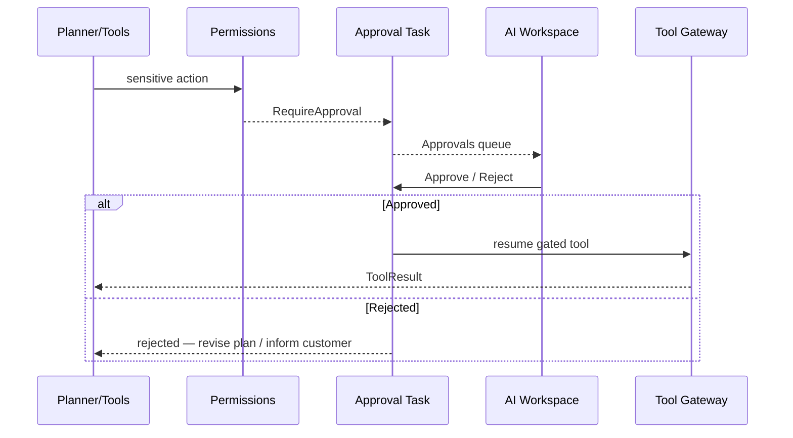
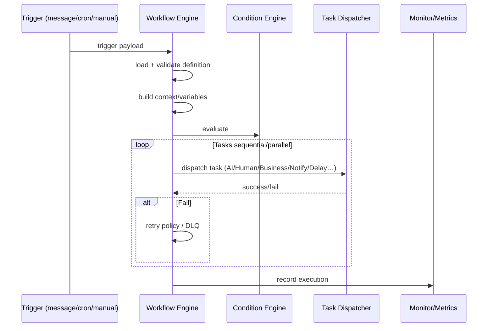

# 03 — Sequence Diagrams (Conceptual)

All diagrams are **conceptual** — no controllers, HTTP, or SDK calls. They describe AOS module choreography.

---

## 1) New WhatsApp message



---

## 2) Messenger message

Same as WhatsApp with **Messenger Adapter**. Difference is only adapter + channel account binding; core sequence unchanged (normalization invariant).

---

## 3) Facebook Comment



---

## 4) Instagram Comment

Identical to Facebook Comment with **Instagram Comments Adapter** and Instagram Direct for private escalation.

---

## 5) Reservation request



---

## 6) Quotation / pricing request

```
Customer → Hub → Conversation → Planner
  → Knowledge (pricing policies) + Memory (customer prefs)
  → Prompt → Provider
  → Tools: SearchProducts / GetPublishedPricing / GenerateQuotation
  → Permissions (custom pricing / discount gates)
  → optional Approval (ApplyDiscount / high-value AcceptQuotation)
  → Reply with quotation summary
```

---

## 7) Complaint

```
Customer complaint
  → Hub normalize
  → Conversation (ownership may shift)
  → Planner intent=complaint
  → Tools: CreateComplaint (+ CreateTask / NotifyStaff)
  → optional TransferConversation (human handover)
  → Memory: store complaint fact (classified)
  → Reply empathy + case id
  → Audit + Analytics markers
```

---

## 8) Transfer to human employee



---

## 9) Approval Flow



---

## 10) Workflow Execution



## Notes

- Channel differences stop at adapters.  
- DressnMore Domain appears only behind Tool Gateway.  
- Workspace is the HITL surface for Approvals and Human Ownership.
